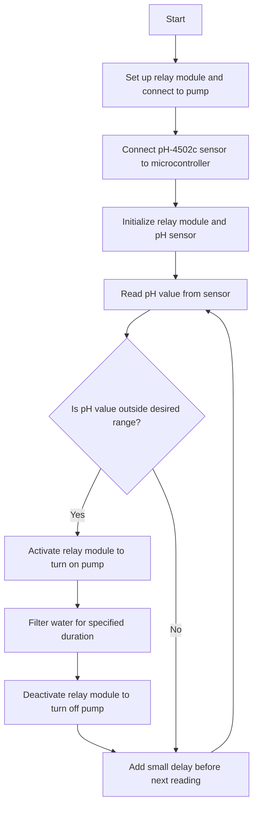

- **Relay Module INI** - `PIN8` - High/Low Voltage
- **Ph Sensor PO** - `A0` - Analog Voltage 
- **Ph Sensor TO - `A1` - Analog Voltage 
- **GSM SIM800L**
	- TXD - `~10`
	- RXD - `~11`

### **Notes**
- Arduino was found to be bent.
	- The ICSP was bent. Initially, it was reckoned during the delivery of the materials. 
	- However, upon further investigation, the board was actually bent before it was delivered.
![[Pasted image 20240421185114.png]]
- **Arduino UNO R3** Board was not detected:
    - Possibly the USB Cable is not a data cable causing the board to be undetected.
    - Another possible problem could be the fact that the board is a cloned version of Arduino Uno R3.
    - Specifically, the board has a CH340 chip.
![[Pasted image 20240421185129.png]]
![[Pasted image 20240421185213.png]]

