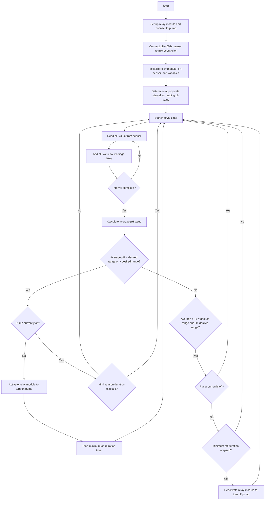

##### GSM SIM800L Module isn't connecting to network
- Problem: Module doesn't connect to the network when a 5G sim was connected
- Solution: Use a <4G SIM since modules like SIM800L does support.
- Problem: Blinks and restart after 8 blinks in the NET indicator.
- Solution: Needs a separate power supply.
##### Volatility of the pH Sensor Causes Unstable On and Off of Pump
- Problem: Direct checking of the pH level and activating the pump based on a single reading can cause sudden and frequent on/off cycles of the pump, leading to instability and potential damage to the pump.
  - The pH sensor may have slight fluctuations or noise in its readings, which can trigger the pump to turn on and off rapidly if the pH value is close to the threshold.
	  - For instance, the pH level determination might trigger every 1 interval. In a case where the pH level gets to 7.0, then goes 6.9, it'll activate and deactivate, which renders the whole mechanism futile.
  - Rapid on/off cycles can strain the pump, reduce its lifespan, and lead to inefficient operation.
- Solution: Implementation of an interval and use averaging to stabilize the pH readings and control the pump activation.
  1. Determine an appropriate interval for reading the pH value (e.g., every 5 seconds, every 10 seconds).
  2. Within each interval, take multiple pH readings (e.g., 3-5 readings) and calculate the average pH value.
  3. Compare the average pH value with the desired range (e.g., between 7.0 and 8.0).
     - If average pH value `desired range < || > desired range`, activate the pump.
     - If the average pH value is `desired range >= || <= desired range`, deactivate the pump.
  4. A minimum on/off duration for the pump to prevent rapid cycling.
     - Once the pump is activated, keep it running for a minimum duration (e.g., 30 seconds) before determining the state of the pump.
  5. Repeat.

**Pseudocode:**
1. The diagram starts with setting up the relay module, connecting the pH sensor, and initializing necessary variables.
2. An appropriate interval for reading the pH value is determined (e.g., every 5 seconds, every 10 seconds).
3. The interval timer starts, and the pH value is read from the sensor.
4. The pH value is added to the readings array.
5. If the interval is not complete, the process goes back to reading the pH value.
6. Once the interval is complete, the average pH value is calculated from the readings array.
7. The average pH value is compared with the desired range:
    - If the average pH is less than the desired range or greater than the desired range, it checks if the pump is currently on.
        - If the pump is not on, the relay module is activated to turn on the pump, and the minimum on duration timer starts.
        - If the pump is already on, it checks if the minimum on duration has elapsed. If not, it goes back to the start of the interval timer. If the minimum on duration has elapsed, it also goes back to the start of the interval timer.
    - If the average pH is within the desired range (greater than or equal to the lower limit and less than or equal to the upper limit), it checks if the pump is currently off.
        - If the pump is off, it goes back to the start of the interval timer.
        - If the pump is on, it checks if the minimum off duration has elapsed. If not, it goes back to the start of the interval timer. If the minimum off duration has elapsed, the relay module is deactivated to turn off the pump, and it goes back to the start of the interval timer.
8. The process repeats from the start of the interval timer.

**Basic Steps (For Researchers High Level):**
1. **Setup:** Connect the pH sensor and relay module. Start with some initial settings.
2. **Reading pH:** Decide how often to check the pH (like every 5 seconds).
3. **Check pH:** Read the pH and store the value.
4. **Interval Time:** Keep checking until the time interval is up.
5. **Calculate Average:** Find the average pH from the readings.
6. **Control Pump:**
    - If pH is too high or too low:
        - Check if the pump is off:
            - If off, turn it on.
            - If on, wait until it's been on for a minimum time before checking again.
    - If pH is okay:
        - Check if the pump is on:
            - If on, wait until it's been off for a minimum time before turning it off.
7. **Repeat:** Go back to step 2 and start over.

